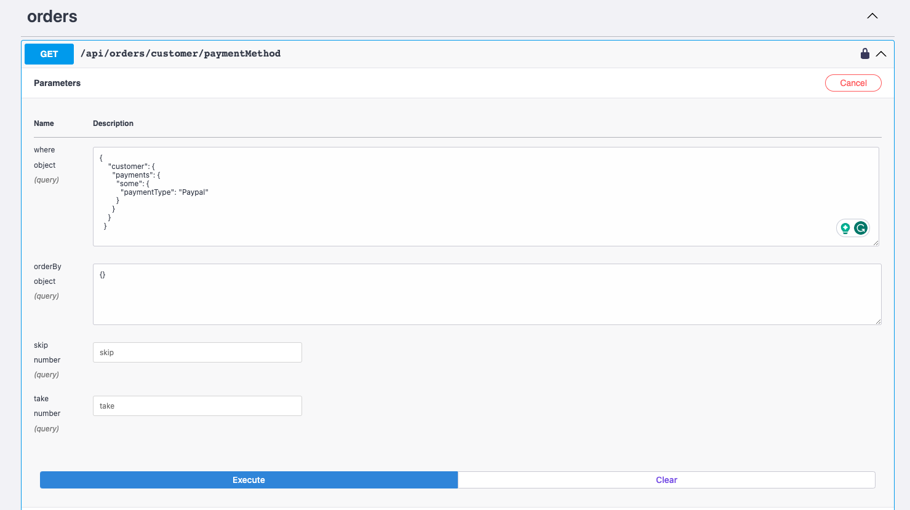

# Extended Queries Example

### Advanced Customization with Amplication-Generated Code

This repository provides insights into modifying and extending code that's generated by Amplication. While Amplication is efficient in generating a foundational scaffold for various data structures, there can be scenarios where the default generated code might not suffice for certain specific requirements.

Here, we outline the steps to integrate custom code into an Amplication-generated project. Specifically, we'll focus on nested query scenarios, highlighting the path through structures like Order > Customer > Payment. The goal is to extend the default functionalities, such as retrieving all orders made using a specific payment method, like "Paypal".

### Step 1 - Familiarize Yourself with the Prisma Schema

Before diving in, it's paramount to have a clear understanding of the prisma.schema file, especially the parts that align with the context of this guide. By examining it, you'll notice the interrelatedness of entities such as Order, Customer, and Payment.

[prisma/schema.prisma](apps/extended-queries-server/prisma/schema.prisma)

```prisma
model Order {
  id         String    @id @default(cuid())
  customer   Customer? @relation(fields: [customerId], references: [id])
  customerId String?
}

model Customer {
  id        String    @id @default(cuid())
  orders    Order[]
  payments  Payment[]
}

model Payment {
  id          String                  @id @default(cuid())
  customer    Customer?               @relation(fields: [customerId], references: [id])
  customerId  String?
  paymentType EnumPaymentPaymentType?
}

enum EnumPaymentPaymentType {
  Card
  Cash
  Paypal
}
```

### Step 2 - Pinpointing the Gaps

 When inspecting the generated code, you might notice that the `${EntityName}WhereInput` for interrelated entities leverages the `${EntityName}WhereUniqueInput`, which is confined to returning just the ID field.

[order/base/OrderWhereInput.ts
](apps/extended-queries-server/src/order/base/OrderWhereInput.ts
)

```typescript 
@InputType()
class OrderWhereInput {
  @ApiProperty({
    required: false,
    type: () => CustomerWhereUniqueInput,
  })
  @ValidateNested()
  @Type(() => CustomerWhereUniqueInput)
  @IsOptional()
  @Field(() => CustomerWhereUniqueInput, {
    nullable: true,
  })
  customer?: CustomerWhereUniqueInput;

 // and the rest of the file...
}

export { OrderWhereInput as OrderWhereInput };

```

To enrich our data-fetching capabilities, we must pivot from using `${EntityName}WhereUniqueInput` to `${EntityName}WhereInput`. Yet, it's imperative to avoid tampering with the OrderWhereInput DTO within the base folder. Instead, we'll craft a custom DTO outside this directory.

```typescript
import { InputType, Field } from "@nestjs/graphql";
import { ApiProperty } from "@nestjs/swagger";
import { ValidateNested, IsOptional } from "class-validator";
import { Type } from "class-transformer";
import { CustomerWhereInput } from "src/customer/base/CustomerWhereInput";
import { FloatNullableFilter } from "src/util/FloatNullableFilter";
import { StringFilter } from "src/util/StringFilter";
import { ProductWhereUniqueInput } from "src/product/base/ProductWhereUniqueInput";
import { IntNullableFilter } from "src/util/IntNullableFilter";

@InputType()
class OrderWhereInputWithExtendedCustomer {
  @ApiProperty({
    required: false,
    type: () => CustomerWhereInput,
  })
  @ValidateNested()
  @Type(() => CustomerWhereInput)
  @IsOptional()
  @Field(() => CustomerWhereInput, {
    nullable: true,
  })
  customer?: CustomerWhereInput;

  @ApiProperty({
    required: false,
    type: FloatNullableFilter,
  })
  @Type(() => FloatNullableFilter)
  @IsOptional()
  @Field(() => FloatNullableFilter, {
    nullable: true,
  })
  discount?: FloatNullableFilter;

  @ApiProperty({
    required: false,
    type: StringFilter,
  })
  @Type(() => StringFilter)
  @IsOptional()
  @Field(() => StringFilter, {
    nullable: true,
  })
  id?: StringFilter;

  @ApiProperty({
    required: false,
    type: () => ProductWhereUniqueInput,
  })
  @ValidateNested()
  @Type(() => ProductWhereUniqueInput)
  @IsOptional()
  @Field(() => ProductWhereUniqueInput, {
    nullable: true,
  })
  product?: ProductWhereUniqueInput;

  @ApiProperty({
    required: false,
    type: IntNullableFilter,
  })
  @Type(() => IntNullableFilter)
  @IsOptional()
  @Field(() => IntNullableFilter, {
    nullable: true,
  })
  quantity?: IntNullableFilter;

  @ApiProperty({
    required: false,
    type: IntNullableFilter,
  })
  @Type(() => IntNullableFilter)
  @IsOptional()
  @Field(() => IntNullableFilter, {
    nullable: true,
  })
  totalPrice?: IntNullableFilter;
}

export { OrderWhereInputWithExtendedCustomer as OrderWhereInputWithExtendedCustomer };
```

To further refine, we'll also tap into the Prisma implementation of OrderWhereInput that encompasses operators such as `AND`, `OR`, `NOT`.

```typescript
export type OrderWhereInput = {
    AND?: Enumerable<OrderWhereInput>
    OR?: Enumerable<OrderWhereInput>
    NOT?: Enumerable<OrderWhereInput>
    createdAt?: DateTimeFilter | Date | string
    customer?: XOR<CustomerRelationFilter, CustomerWhereInput> | null
    customerId?: StringNullableFilter | string | null
    discount?: FloatNullableFilter | number | null
    id?: StringFilter | string
    product?: XOR<ProductRelationFilter, ProductWhereInput> | null
    productId?: StringNullableFilter | string | null
    quantity?: IntNullableFilter | number | null
    totalPrice?: IntNullableFilter | number | null
    updatedAt?: DateTimeFilter | Date | string
  }
```

[customer/dtos/CustomerWhereInputWithOperator.ts](apps/extended-queries-server/src/customer/dtos/CustomerWhereInputWithOperator.ts)

```typescript
import { InputType, Field } from "@nestjs/graphql";
import { IsOptional } from "class-validator";
import { Type } from "class-transformer";
import { CustomerWhereInput } from "../base/CustomerWhereInput";

@InputType()
class CustomerWhereInputWithOperator extends CustomerWhereInput {
  @Type(() => CustomerWhereInput)
  @IsOptional()
  @Field(() => CustomerWhereInput, {
    nullable: true,
  })
  AND?: CustomerWhereInput;

  @Type(() => CustomerWhereInput)
  @IsOptional()
  @Field(() => CustomerWhereInput, {
    nullable: true,
  })
  OR?: CustomerWhereInput;

  @Type(() => CustomerWhereInput)
  @IsOptional()
  @Field(() => CustomerWhereInput, {
    nullable: true,
  })
  NOT?: CustomerWhereInput;
}

export { CustomerWhereInputWithOperator as CustomerWhereInputWithOperator };
```

With this foundation, we can now enhance the `OrderWhereInputWithExtendedCustomer` to employ the `CustomerWhereInputWithOperator` as opposed to the plain `CustomerWhereInput`.

[order/dtos/OrderWhereInputWithExtendedCustomer.ts](apps/extended-queries-server/src/order/dtos/OrderWhereInputWithExtendedCustomer.ts)

```typescript
import { InputType, Field } from "@nestjs/graphql";
import { ApiProperty } from "@nestjs/swagger";
import { ValidateNested, IsOptional } from "class-validator";
import { Type } from "class-transformer";
import { CustomerWhereInputWithOperator } from "src/customer/dtos/CustomerWhereInputWithOperator";
import { FloatNullableFilter } from "src/util/FloatNullableFilter";
import { StringFilter } from "src/util/StringFilter";
import { ProductWhereUniqueInput } from "src/product/base/ProductWhereUniqueInput";
import { IntNullableFilter } from "src/util/IntNullableFilter";

@InputType()
class OrderWhereInputWithExtendedCustomer {
  @ApiProperty({
    required: false,
    type: () => CustomerWhereInputWithOperator,
  })
  @ValidateNested()
  @Type(() => CustomerWhereInputWithOperator)
  @IsOptional()
  @Field(() => CustomerWhereInputWithOperator, {
    nullable: true,
  })
  customer?: CustomerWhereInputWithOperator;

  @ApiProperty({
    required: false,
    type: FloatNullableFilter,
  })
  @Type(() => FloatNullableFilter)
  @IsOptional()
  @Field(() => FloatNullableFilter, {
    nullable: true,
  })
  discount?: FloatNullableFilter;

  @ApiProperty({
    required: false,
    type: StringFilter,
  })
  @Type(() => StringFilter)
  @IsOptional()
  @Field(() => StringFilter, {
    nullable: true,
  })
  id?: StringFilter;

  @ApiProperty({
    required: false,
    type: () => ProductWhereUniqueInput,
  })
  @ValidateNested()
  @Type(() => ProductWhereUniqueInput)
  @IsOptional()
  @Field(() => ProductWhereUniqueInput, {
    nullable: true,
  })
  product?: ProductWhereUniqueInput;

  @ApiProperty({
    required: false,
    type: IntNullableFilter,
  })
  @Type(() => IntNullableFilter)
  @IsOptional()
  @Field(() => IntNullableFilter, {
    nullable: true,
  })
  quantity?: IntNullableFilter;

  @ApiProperty({
    required: false,
    type: IntNullableFilter,
  })
  @Type(() => IntNullableFilter)
  @IsOptional()
  @Field(() => IntNullableFilter, {
    nullable: true,
  })
  totalPrice?: IntNullableFilter;
}

export { OrderWhereInputWithExtendedCustomer as OrderWhereInputWithExtendedCustomer };
```

### step 3 - Crafting a Customized OrderFindManyArgs DTO

Given that we're keen on safeguarding the integrity of the base folder and maintaining the versatility of our queries, it's apt to design a new findManyArgs DTO. This DTO will utilize the `OrderWhereInputWithExtendedCustomer` in lieu of the more restricted `OrderWhereInput`.

[order/dtos/OrderFindManyExtendedWhereArgs.ts](apps/extended-queries-server/src/order/dtos/OrderFindManyExtendedWhereArgs.ts)

```typescript
import { ArgsType, Field } from "@nestjs/graphql";
import { ApiProperty } from "@nestjs/swagger";
import { IsOptional, ValidateNested, IsInt } from "class-validator";
import { Type } from "class-transformer";
import { OrderWhereInputWithExtendedCustomer } from "./OrderWhereInputWithExtendedCustomer";
import { OrderOrderByInput } from "../base/OrderOrderByInput";

@ArgsType()
class OrderFindManyExtendedWhereArgs {
  @ApiProperty({
    required: false,
    type: () => OrderWhereInputWithExtendedCustomer,
  })
  @IsOptional()
  @ValidateNested()
  @Field(() => OrderWhereInputWithExtendedCustomer, { nullable: true })
  @Type(() => OrderWhereInputWithExtendedCustomer)
  where?: OrderWhereInputWithExtendedCustomer;

  @ApiProperty({
    required: false,
    type: [OrderOrderByInput],
  })
  @IsOptional()
  @ValidateNested({ each: true })
  @Field(() => [OrderOrderByInput], { nullable: true })
  @Type(() => OrderOrderByInput)
  orderBy?: Array<OrderOrderByInput>;

  @ApiProperty({
    required: false,
    type: Number,
  })
  @IsOptional()
  @IsInt()
  @Field(() => Number, { nullable: true })
  @Type(() => Number)
  skip?: number;

  @ApiProperty({
    required: false,
    type: Number,
  })
  @IsOptional()
  @IsInt()
  @Field(() => Number, { nullable: true })
  @Type(() => Number)
  take?: number;
}

export { OrderFindManyExtendedWhereArgs as OrderFindManyExtendedWhereArgs };

```

### Step 4 - Service-Level Implementation

Now, we venture into the service layer. In our `order.service.ts`, we've integrated a method designed to retrieve orders based on the specified conditions.

[order.service.ts](apps/extended-queries-server/src/order/order.service.ts)

```typescript
import { Order, Prisma } from "@prisma/client";


async findManyOrdersWherePaymentMethod<T extends Prisma.OrderFindManyArgs>(
    args: Prisma.SelectSubset<T, Prisma.OrderFindManyArgs>
  ): Promise<Order[]> {
    return this.prisma.order.findMany(args);
  }
```

### Step 5 - Bringing it to GraphQL

With our service layer primed, we shift our attention to the GraphQL resolver. The aim is to ensure that our GraphQL API can handle the complexities of our enhanced nested queries.

[order/order.resolver.ts](apps/extended-queries-server/src/order/order.resolver.ts)

```typescript
import { OrderFindManyExtendedWhereArgs } from "./dtos/OrderFindManyExtendedWhereArgs";

@common.UseInterceptors(AclFilterResponseInterceptor)
  @graphql.Query(() => [Order])
  @nestAccessControl.UseRoles({
    resource: "Order",
    action: "read",
    possession: "any",
  })
  async ordersWherePaymentMethod(
    @graphql.Args() args: OrderFindManyExtendedWhereArgs
  ): Promise<Order[]> {
    return this.service.findManyOrdersWherePaymentMethod(args);
  }
```

#### Test it in [http://localhost:3000/grpahql](http://localhost:3000/grpahql)

The query:

```graphql
query OrdersWherePaymentMethod($where: OrderWhereInputWithExtendedCustomer) {
  ordersWherePaymentMethod(where: $where) {
    id
    customer {
      id
      email
      payments {
        paymentType
      }
    }
  }
}
```

The variables:

```graphql
{
  "where": {
    "customer": {
      "payments": {
        "some": {
          "paymentType": "Paypal"
        }
      }
    }
  }
}
```

The result:


### Step 6 - Embracing the REST Paradigm

Lastly, for those vested in RESTful services, we've got you covered. In our order controller, we've curated a method to retrieve orders based on their payment methods.

```typescript
import { OrderFindManyExtendedWhereArgs } from "./dtos/OrderFindManyExtendedWhereArgs";

  @common.UseInterceptors(AclFilterResponseInterceptor)
  @common.Get("/customer/paymentMethod")
  @swagger.ApiOkResponse({ type: [Order] })
  @ApiNestedQuery(OrderFindManyExtendedWhereArgs)
  @nestAccessControl.UseRoles({
    resource: "Order",
    action: "read",
    possession: "any",
  })
  @swagger.ApiForbiddenResponse({
    type: errors.ForbiddenException,
  })
  async ordersWherePaymentMethod(@common.Req() request: Request): Promise<Order[]> {
    const args = plainToClass(OrderFindManyExtendedWhereArgs, request.query);
    return this.service.findManyOrdersWherePaymentMethod({
      ...args,
      select: {
        createdAt: true,
        customer: {
          select: {
            id: true,
            payments: {
              select: {
                paymentType: true, // <= pay attention to this
              },
            }
          },
        },
        discount: true,
        id: true,
        product: {
          select: {
            id: true,
          },
        },
        quantity: true,
        totalPrice: true,
        updatedAt: true,
      },
    });
  }
```

#### Test it in [http://localhost:3000/api](http://localhost:3000/api)



The response json:

```json
[
  {
    "createdAt": "2023-10-13T09:20:09.222Z",
    "customer": {
      "id": "clnoedikh0000p5smo00rts3i",
      "payments": [
        {
          "paymentType": "Paypal"
        }
      ]
    },
    "discount": 10,
    "id": "clnoeeadi0002p5smxsicb8he",
    "product": null,
    "quantity": 2,
    "totalPrice": 300,
    "updatedAt": "2023-10-13T09:19:45.663Z"
  },
  {
    "createdAt": "2023-10-13T09:50:40.568Z",
    "customer": {
      "id": "clnofg29u0000p506rfzmxeqd",
      "payments": [
        {
          "paymentType": "Paypal"
        }
      ]
    },
    "discount": null,
    "id": "clnofhjg80002p506btxsgw9q",
    "product": null,
    "quantity": 8,
    "totalPrice": 750,
    "updatedAt": "2023-10-13T09:50:10.159Z"
  }
]
```